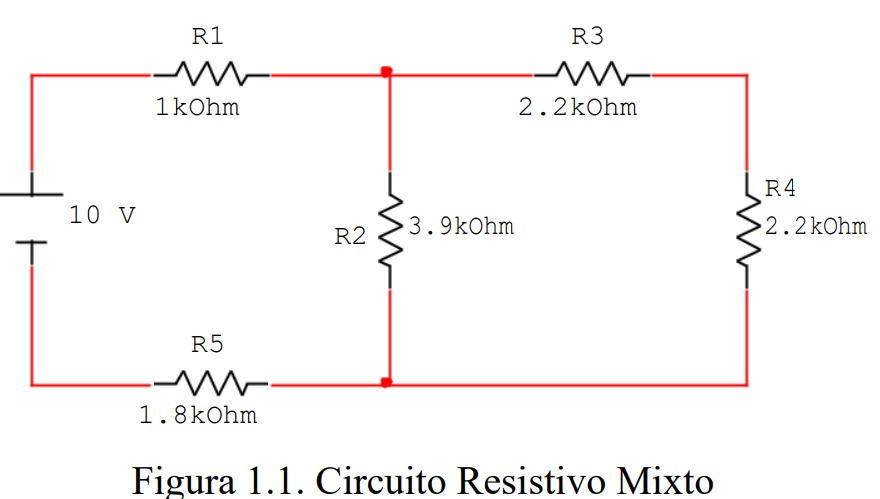

# Informe1
Ley de Kirchhoff

1.OBJETIVOS 

◙ Describir las características de las ramas, los nodos y los lazos de un circuito. Inferir las Leyes de Kirchhoff en base a los resultados experimentales de la simulación. 

◙ A través de las Leyes de Kirchhoff	calcular los valores teóricos de las intensidades de corriente y los voltajes en un circuito específico.  

◙ Aplicar la Ley de Ohm para hallar las  corrientes y tensiones.

◙ Demostrar como la Ley de Kirchhoff es una muestra de la ley de conservacion de la carga y energia.

◙ Comparar los calculos analiticos con los resultados simulados y hallar el error porcentual.

2. MARCO TEÓRICO

◙ Las leyes de voltajes y corrientes de Kirchhoff cuyas abreviaciones son LVK y LCK respectivamente, son dos métodos utilizados en el análisis de circuitos eléctricos basados en el principio de conservación de la energía y la carga en los circuitos eléctricos.  

- Estas leyes establecen:

☻ Ley de Kirchhoff de Corrientes: La suma de las corrientes entrantes a un
nodo es igual a la suma de las corrientes salientes del mismo.

☻ Ley de Kirchhoff de Voltajes: La suma algebraica de las caídas de voltaje en una
trayectoria cerrada de nodos es igual a la suma de las elevaciones de voltaje de la misma.

3. DIAGRAMAS

☻Diagrama Sistemático

☻Diagrama de medición de amperaje
IMG/Tabla voltaje-intencidad.jpeg

☻Diagrama de medición de voltaje

5.LISTA DE COMPONENTES

6. EXPLICACIÓN 

A modo de una explicación clara se tomará en cuenta el flujo de electrones desde el lado positivo de la fuente de voltaje, hacia el lado negativo de la misma. El circuito eléctrico siempre tiene el mismo funcionamiento, ya sea simple o complejo. 

El voltaje, la tensión o diferencia de potencial que suministra la fuente de alimentación al circuito se caracteriza por tener su valor fijo (10 V). En dependencia de la mayor o menor resistencia en ohmios que encuentre el flujo de corriente de electrones al recorrer el circuito, así será su intensidad en amperios. Al inicio nos encontramos con una resistencia de 1kohm. 

Una vez que la corriente de electrones logra vencer la primera resistencia (1 ohm) y las posteriores, la corriente eléctrica retorna a la fuente de fuerza electromotriz por su polo negativo. El flujo de corriente eléctrica o de electrones se mantendrá circulando por el circuito hasta tanto no se accione el interruptor que permite detenerlo, en este caso, al detener la simulación. La resistencia eléctrica tiene la función de oponerse al paso de corriente eléctrica en el circuito. Esta característica de oposición al paso de la corriente eléctrica, produce una serie de efectos de los cuales podemos ser testigos. Efectos como la caída de tensión (divisor de tensión) o establecer la corriente que va a circular por una rama poniendo una resistencia u otra en paralelo.   

*Resultados obtenidos de voltaje y corriente, en cada elemento del circuito:*
 

-Tabla 1.1. Resultados obtenidos de voltaje y corriente, en cada elemento del circuito: 

